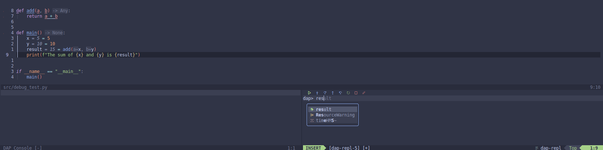

# Blink DAP
A plugin to add DAP completion to the [blink.cmp](https://github.com/Saghen/blink.cmp) completion engine.



## Installation (via Lazy)
```lua
{
    "bramdelta/blink-dap",
},
```

## Setup/Configuration
Add the following to your Blink configuration:

```lua
require("blink-cmp").setup({
	sources = {
		default = { "lsp", "path", "snippets", "dap" }, -- Include the source here
		providers = {
			dap = {
				name = "dap", -- This should match the source specified above
				module = "blink-dap",
                opts = {
                    -- If you want to include DAP commands like `.scopes` as well
                    include_repl = true,
                    filetypes = {
                        -- The name of the adapter `type` in your debugger configuration file
                        python = {
                            -- What trigger characters to use for additional completions, i.e.
                            -- foo.bar would mean to use . to prompt for available properties of foo
                            trigger_characters = { "." },
                        },
                    },
                    -- Which filetypes to enable completion for.
                    -- Use `:echo &filetype` to find this per buffer
                    dap_filetypes = { "dap-repl" },
                }
			},
		}
	}
}
```

## Acknowledgements
[cmp-dap](https://github.com/rcarriga/cmp-dap) for making the original plugin for CMP, much of their code referenced in creating this.
